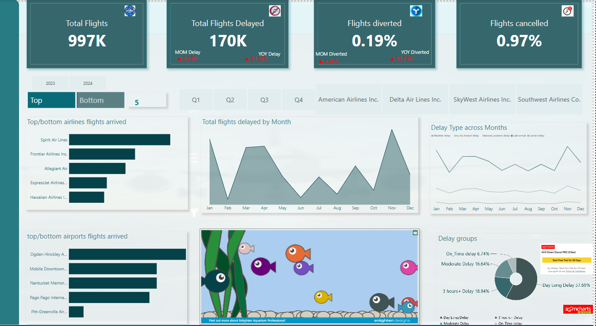
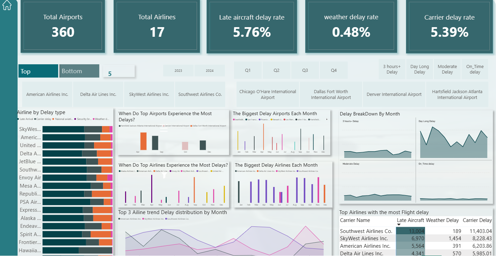

# Airline-Analysis

## Introduction
Flight delays are a common challenge in the aviation industry, affecting both travelers and airlines. Understanding the patterns behind these delays can help improve efficiency and enhance passenger experience.

This project uses Data visualization tools to high
lights critical trends and insights, enabling stakeholders to make data-driven decisions to mitigate delays flight delay data across various airlines and airports, providing insights into:
- The number of flights, delays, cancellations, and diversions
- Key delay types (e.g., late aircraft, carrier, weather, security)
- Airlines and airports with the highest delay rates
- Monthly trends in flight delays and their contributing factors

## Problem Statement
- High Flight Delays:How do flight delays impact airline operations and passenger experience, and what insights can help mitigate their effects
- Major Causes of Delays: What are the major factors causing delay?
- Airline & Airport Performance: Which airlines and airports experience the most delays, and what patterns emerge from their historical performance data
- Seasonal & Monthly Trends: Do flight delays follow specific seasonal or monthly trends, and how can this information help airlines optimize scheduling?
- Operational & Financial Losses: How do flight delays translate into operational inefficiencies and financial losses, and what data-driven strategies can minimize these costs?

## Skills/Concepts demonstrated
- DAX
- Parameters
- Buttons
- Filters
- Tooltips
- Bookmarks
- Page navigations

## Visualization
The Report comprises two(2) pages

- Flight Delay
- Airport Delay. You can interact with the Report [here](https://app.powerbi.com/view?r=eyJrIjoiODRjN2Q0MTgtZTFhNS00MzJhLWI2NDItYTg4Y2Q2OGRkNjQ2IiwidCI6IjQ2ODM5MjNmLTdhMjQtNDBlNC05MzhlLWNiZGIwNjVjY2NjZSJ9)

### Flight Delay

## Analysis
- **South West Airline** was found to have the most delay with **178784** total delayed flights, followed by **Delta Airlines Inc.** with **130902** Flights delayed.
- **Dallas Fot Worth International Airport** topped the chart as the airport to record the highest delay with **8448** delayed flights.
- **South West Airline** also recorded having the longest **Day-long delay** which constituted of **77.51%** of total delay breakdown

### Airline Delay

## Analysis 
- **Dallas Fort Airport** recorded its highest delay in the month of **April**
- **Hartsfield** recorded its highest delay in **September** and **December**
- **Denver** recorded its highest delay in **October**
- While **Delta Airline** had the most delay in **September**, **Skywest** in **February**,**May**,**July** and **November** , **United Airline** had its own highest delay in **October** and **December**
 
## Conclusion and Recommendations
- High flight delay caused majorly by **Aviation** delays from other airlines impact operations leading to passengers frustration and discomfort
- **Weather** has significantly low impact on delay in contrast to **Aviation** and has no effect in time trend Analysis.
- Flight delays wee found to peak during January and November this could be due to influx of travellers for Festive activities happening during these period.
## Recommendations
- Improve communication between **Air traffic Controllers**, pilots, and airline operations for better situational awareness to reduce aviation delay
- Deploy AI-based predictive models to anticipate traffic surges and adjust schedules accordingly.

  

